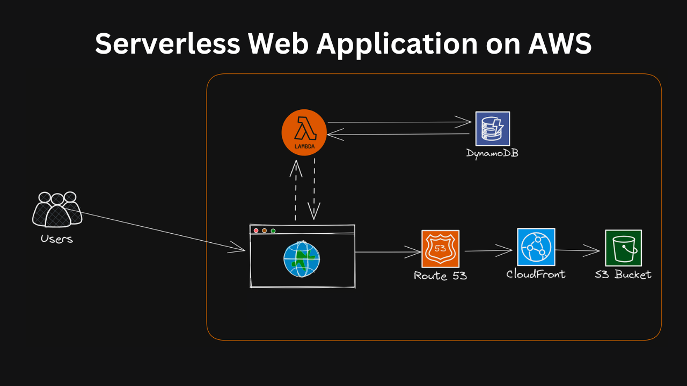

# Serverless Web Application on AWS

## Project Name: Serverless Web Application on AWS

[Live Demo](https://greeting.harry-vu.com/)

### Project Description:

In this project, I built a serverless web application using AWS Lambda, DynamoDB, and S3. The application allows users to create, read, update, and delete (CRUD) items from a DynamoDB table.

### Project Architecture:

### Steps to Build the Project:

* Created a DynamoDB table to store the items.
* Built a Lambda function to handle the CRUD operations on the DynamoDB table.
* Used S3 to store and host the web application's static files (HTML, CSS, and JavaScript).
* Created a CloudFront distribution to serve the S3-hosted static files with low latency.

### Expected Outcome:

Upon completing the project, I have a working serverless web application hosted on AWS.
I gained hands-on experience building a serverless application using AWS Lambda, DynamoDB, S3, and CloudFront.
Additionally, I have experience working with AWS services and integrating them to build a complete solution.

This project helped me improve my skills in cloud computing, serverless architecture, and AWS services.
